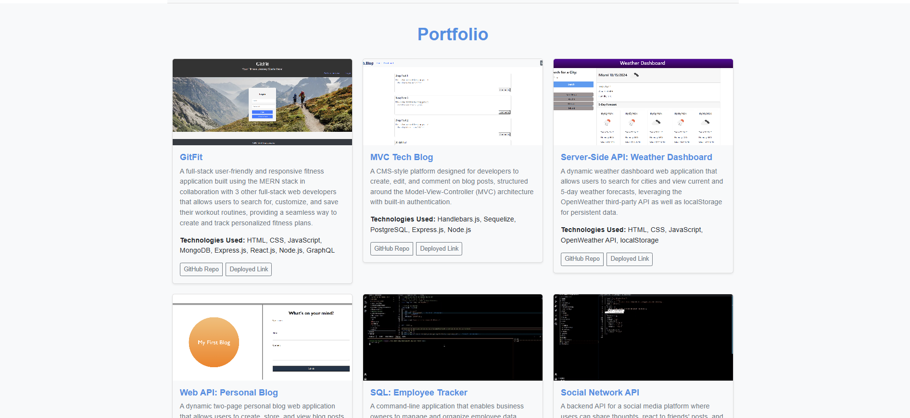
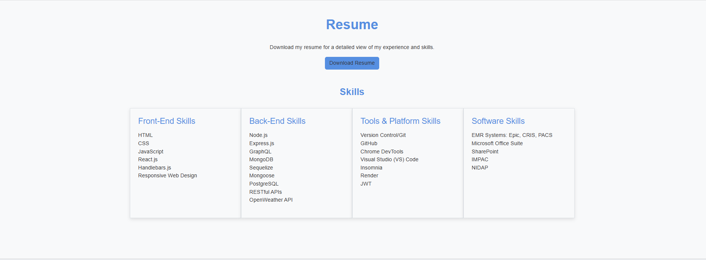
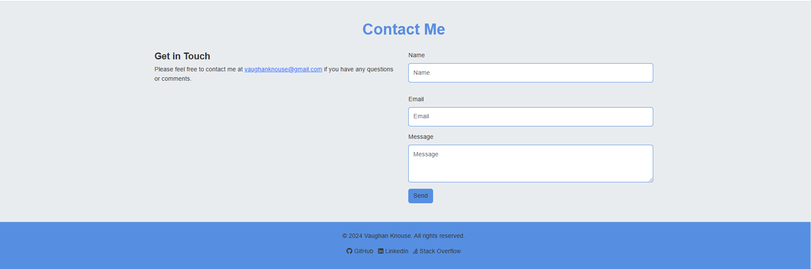

# Vaughan Knouse's Portfolio <!-- omit in toc -->


## Description <!-- omit in toc -->

A portfolio built with HTML, CSS, and Bootstrap showcasing my work as a Full-Stack Web Developer, featuring projects built with modern web technologies, a responsive design, and a user-friendly interface.

This portfolio website is designed to give an in-depth look at my skills, experience, and past projects. The site is structured with a clean, modern aesthetic, featuring a responsive design to provide an optimal viewing experience across various devices. Each section of the website provides valuable information for prospective clients, collaborators, or employers, showcasing my skills in front-end and back-end development, my proficiency with development tools, and my experience in the healthcare sector.

The project follows a modular approach, with each section clearly defined and styled to ensure a consistent user experience. My goal with this portfolio is to highlight both my technical abilities and my dedication to creating impactful, user-centered web applications.

## Table of Contents <!-- omit in toc -->

- [Technologies Used](#technologies-used)
- [Features](#features)
  - [General Site Layout](#general-site-layout)
  - [Portfolio Section](#portfolio-section)
  - [Resume Section](#resume-section)
  - [Contact Section](#contact-section)
- [Installation and Setup](#installation-and-setup)
  - [Screenshots](#screenshots)
- [Links](#links)
- [Credits](#credits)
- [License](#license)
- [Questions](#questions)

## Technologies Used

- **HTML5**: Markup language for structuring content on the web.
- **CSS3**: Styling language for creating responsive layouts and visually appealing designs.
  - **Custom CSS** with variables for colors, shadows, and spacing for a consistent theme.
- **Bootstrap 5**: Framework for responsive design, including grid layout, components, and utilities.
- **JavaScript**: Used for dynamic content, form handling, and interactive elements.
- **Font Awesome**: Icon library used for social media icons and other symbols throughout the site.

## Features

- **Header and Home Page**: Displays my name and navigation links to different sections of the portfolio along with a Home page briefly introducing myself.
- **About Me**: Contains a recent photo and a short bio about me.
- **Portfolio**: Showcases my recent projects with titles, images, brief descriptions, technologies used, and links to both the deployed applications and their corresponding GitHub repositories.
- **Resume**: Provides a link to download my resume and a list of my skills in front-end, back-end, tools and technology, and software.
- **Contact**: Includes a contact form with fields for a name, email address, and message, with validation to ensure all fields are filled out correctly.
- **Footer**: Contains links to my GitHub, LinkedIn, and Stack Overflow profiles.

### General Site Layout

- **Hero Section**: Includes an eye-catching introduction to the portfolio, with a gradient background and distinctive border styling.
- **Navigation Bar**: Sticky and responsive navigation for easy access to sections, with hover effects and active link highlighting.
- **Footer with Social Links**: Links to GitHub, LinkedIn, and Stack Overflow with Font Awesome icons.

### Portfolio Section

- **Project Cards**: Each project card features a thumbnail image, title, and description. Hover effects and shadowing create a dynamic, engaging layout.
- **Hover Effects**: Smooth scaling effects and shadow adjustments on hover for interactive feedback.

### Resume Section

- **Skills Grid**: Organized layout with sections for Front-End Skills, Back-End Skills Tools & Platform Skills, and Software Skills.
- **Downloadable Resume**: Button for downloading a PDF of my resume, allowing users easy access to my full work history.

### Contact Section

- **Contact Form**: Users can fill out a form to get in touch, including fields for name, email, and message.
- **Form Validation**: Custom styling for form focus, with blue shadow effects for an enhanced user experience.

## Installation and Setup

1. **Clone the Repository**:

```bash
git clone https://github.com/vaughanknouse/Vaughan-portfolio.git
cd Vaughan-portfolio
```

2. **Open the HTML File**: Simply open the index.html file in your preferred browser to view the site.
3. **Customize (Optional)**: Update paths, colors, or any content as desired.
4. **Deploy**: You can deploy the site on platforms like GitHub Pages, Netlify, or Render.

### Screenshots

The following screenshot demonstrates the application's functionality and appearance:

**Home with Header and About Me:**


**Portfolio with Projects:**



**Resume with Skills:**



**Contact and Footer:**



## Links

GitHub Repository: <https://github.com/vaughanknouse/Vaughan-portfolio>

Deployed Application Link: <https://vaughanknouse.github.io/Vaughan-portfolio/>

## Credits

[ChatGPT](https://chatgpt.com/?oai-dm=1)

[Bootstrap](https://getbootstrap.com/)

[Font Awesome](https://fontawesome.com/icons/link?s=solid)

## License

This project is licensed under the MIT license. For more information, please visit [this link](https://opensource.org/licenses/MIT).

## Questions

For any questions or feedback, please contact me via email at <vaughanknouse@gmail.com>.

Additionally, you can find me on GitHub at [vaughanknouse](https://github.com/vaughanknouse).
